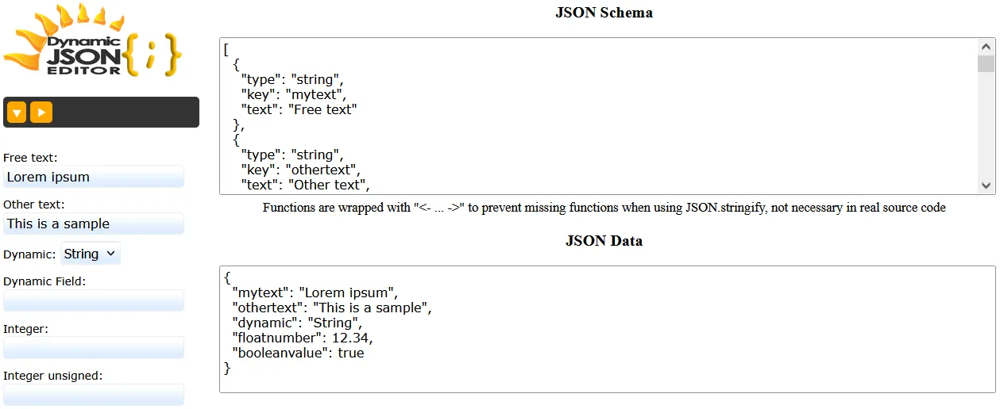

<p align="center">
  
</p>

# [JuNe Dynamic JSON Editor](https://github.com/EduardoRuizM/june-dynamic-json-editor "Dynamic JSON Editor")
A dynamic, schema-driven JSON editor that builds interactive forms on the fly, validates data in real time, and adapts its structure and behavior based on user input.

JuNe Dynamic JSON Editor is a lightweight, framework-agnostic JavaScript editor that generates editable forms from a JSON definition.
It supports dynamic properties, arrays, nested objects, custom field types, live validation, and conditional behavior between fields - all without requiring a strict JSON Schema implementation.

### [👉Try it out: Live Demo](https://EduardoRuizM.github.io/june-dynamic-json-editor/demo.html "👉Try it out: Live Demo")




## ✨ Features
- 🧩 **Schema-driven UI**
  - Build forms dynamically from a simple JSON definition.
  - Supports nested objects and arrays.
  - No dependency on JSON Schema (but compatible in spirit).

- 🔄 **Dynamic behavior**
  - Fields can react to changes in other fields.
  - Enable, disable, show, hide, or modify fields at runtime.
  - Dynamic arrays with add/remove controls.

- 🧪 **Live validation**
  - Validate values while typing (`oninput` / `addEventListener`).
  - Built-in support for numbers, booleans, enums, and fixed values.
  - Easily extendable with custom validators (IP, ranges, formats, etc.).

- 🛠 **Custom field types**
  - Strings, integers, floats, booleans.
  - Enums (select).
  - Fixed / read-only values.
  - Extensible for domain-specific types (IP, CIDR, VLAN, etc.).

- 📦 **Pure JavaScript**
  - No frameworks required.
  - No external dependencies.
  - Works with plain HTML, CSS, and JS.

- 🧠 **Data-first design**
  - Uses stable `key` identifiers instead of labels or text.
  - Clean separation between UI (`text`) and data (`key`).
  - Predictable JSON output.

# Author
[Eduardo Ruiz](https://github.com/EduardoRuizM) <<eruiz@dataclick.es>>

# JuNe / JUst NEeded Philosophy
1. **Source code using less code as possible**
  So you can understand code and find bugs easier.
2. **Few and optimized lines is better**
  Elegant design.
3. **Avoid external dependencies abuse/bloated, and possible third-party bugs**
  Less files size, better and faster to the interpreter.
4. **Clear and useful documentation with examples and without verbose**
  Get to the point.
5. **Avoid showing unsolicited popups, notifications or messages in frontend**
  For better User eXperience.
6. **Simple UI**, without many menus/options and with few clicks to get to sites.
7. Consequences of having a lot of code (and for simple things): Having to work and search through many files and folders with a lot of wasted time, successive errors due to missing unknown files, madness to move a code to another project, errors due to recursive dependencies difficult to locate, complexity or impossibility to migrate to new versions, unfeasibility to follow the trace with so much code, risk of new errors if the functionality is extended, problems not seen at the first sight, general slowness in the whole development due to excessive and unnecessary code.

# Fields
| 🌍 Name | Type | Required | Description |
| --- | --- | :---: | --- |
| **type** | String | ✔ | Field type (see Types) |
| **key** | String | ✔ | Identifier key for field (id) |
| **text** | String | ✔ | Text description for labels |
| **attrs** | Object | - | INPUT/SELECT attributes: <br>**type** (String): Input Type for string fields (date, email, tel, url...)<br>**maxlength** (Number): Max string length<br>**min** (Number): Minimum value number<br>**max** (Number) Maximum value number<br>**readonly** (Bool): Readonly input field<br>(and all HTML input/select attributes)... |
| **fields** | Array | - | Nested fields array with same structure as fields |
| **mask** | String | - | IPv4 range check using mask |
| **depends_on** | Object | - | Object for dynamic fields to replace field new data { key: keySourceField, set: { type: value => functionForNewType[, attrs: { inputAttribute: value => functionForNewMin } ] } } |

# Types
| ⚙️ Name | Input Type | Description |
| --- | --- | --- |
| **string** | text (date, email, tel, url...) | String |
| **int** | number | Integer number |
| **float** | number | Float number |
| **bool** | checkbox | Boolean |
| **fixed** | hidden | Fixed readonly value |
| **ipv4** | text | IPv4 |

# Dynamic Field
The type and attributes of a field can be conditioned based on the value of another 'enum' field. When that value changes, it assigns properties to the target field and can use JavaScript functions to allow all kinds of possibilities, the function receives the changed value from the source field.
```
// Source Field
{ type: 'enum', key: 'dynamic', text: 'Dynamic', values: [ 'String', 'Fixed' ], value: 'String' },
// Dynamic Target Field
{ type: 'string', key: 'dynamicfield', text: 'Dynamic Field',
    depends_on: {
		// Key of the source field that will modify the properties
		key: 'dynamic',
		// Set of properties to modify; you can use fixed values or functions that receive the key's value when it changes
		set: {
			// type is string if source field is Fixed otherwise  string
			type: value => value === 'Fixed' ? 'fixed' : 'string',
			value: 'myFixed',
			attrs: { // Optional attributes
				// Assigns min attribute 10 if value === 'value1', otherwise 100
				"min": "value => value === 'value1' ? 10 : 100"
			 }
		}
    }
  }
```

## 🧱 Example Schema
```
// Array with all fields and attributes
// [{ type: type1, key: key1, text: Description1 }, { type: type2, key: key2, text: Description2 }...]
const schema = [
  { type: 'string', key: 'mytext', text: 'Free text' },
  { type: 'string', key: 'othertext', text: 'Other text', attrs: { maxlength: 20 } },
  { type: 'enum', key: 'dynamic', text: 'Dynamic', values: ['String', 'Fixed'], value: 'String' },
  { type: 'string', key: 'dynamicfield', text: 'Dynamic Field',
    depends_on: {
      key: 'dynamic', set: {type: value => (value === 'Fixed') ? 'fixed' : 'string', value: 'myFixed' }
    }
  },
  { type: 'int', key: 'intnumber', text: 'Integer' },
  { type: 'int', key: 'intunsigned', text: 'Integer unsigned', attrs: { min: 0 } },
  { type: 'float', key: 'floatnumber', text: 'Float' },
  { type: 'string', key: 'datevalue', text: 'Date', attrs: { type: 'date' } },
  { type: 'fixed', key: 'fixedvalue', text: 'Fixed value', value: 12 },
  { type: 'bool', key: 'booleanvalue', text: 'Yes/No' },
  { type: 'ipv4', key: 'ip', text: 'IPv4', mask: '255.255.255.0' },
  { type: 'object', key: 'objectlist', text: 'Elements Object',
    fields: [
      { type: 'string', key: 'subobject', text: 'SubObject' }
    ]
  },
  { type: 'array', key: 'elementslist', text: 'Elements Array List',
    fields: [
      { type: 'string', key: 'item', text: 'Item' }
    ]
  }
];
```

## 📑 Example Data
```
// Object with initial data
// { key1: value1 }, { key2: value2 },...
const data = {
  'mytext': 'Lorem ipsum',
  'othertext': 'This is a sample',
  'dynamic': 'String',
  'floatnumber': 12.34,
  'booleanvalue': true
};
```

## ▶ Usage

```
// Include JuNe Dynamic JSON Editor
<script src="june-dynamic-json-editor.js"></script>

// Create container
<div id="editor"></div>

// Create a new form instance
form = new JuNeDynamicJSONEditor(schema, 'editor');

// Build the form in the container
form.build();

// Populate the form with initial data (optional)
form.populate(data);

// Collect the current form data as JSON
const generated_json = form.collect();
// Print formatted JSON to the console
console.log(JSON.stringify(generated_json, null, 4));
```

# JuNe Development Ecosystem
Everything you need to develop your project:
### Backend
- [JuNe BackServer](https://github.com/EduardoRuizM/june-backserver "JuNe BackServer") With request routing, tokens, file upload, send Emails, WebSockets, SSE and captcha.
- [JuNe WebServer](https://github.com/EduardoRuizM/june-webserver "JuNe WebServer") Web server with HMR.

### Frontend
- [JuNe PaulaJS](https://github.com/EduardoRuizM/june-paulajs "JuNe PaulaJS") Powerful JavaScript framework
- [JuNe CSS](https://github.com/EduardoRuizM/june-css "JuNe CSS") Full responsive CSS library with icons.
